# Lab 3 - Intensity Transformations
## 1 - Contrast Enhancement with imadjust

### Import
Look at info of image and read image data into a matrix *f* 

```
clear all
imfinfo('assets/breastXray.tif')
f = imread('assets/breastXray.tif');
imshow(f)
```

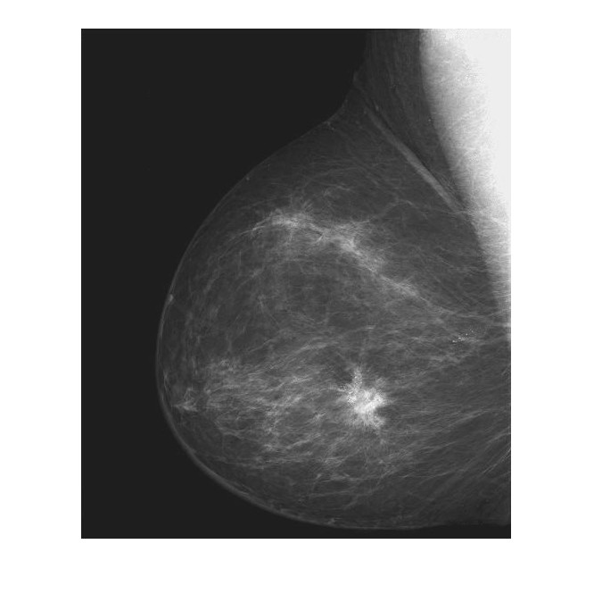

- *f* is stored as a `571x482 uint8`
- Intensity of any pixel can be printed by `f(x,y)` 
	- e.g. `f(3,10) = uint8 28`
	- Intensity values should be between 0 - 255, as it is a `uint8`
- Specific parts of an image can be created by slicing the matrix indices with `:` 
	- `f(1:285,:)` uses all columns, and rows 1-285 (top half)
	- `f(:, 241:482)` uses all rows, and columns 241-482 (right half)
- Find max and min intensity values with `[fmin, fmax] = bounds(f(:))`
	- Function used is **bounds()**
	- note `f(:)` means check every column, if unspecified it will return max and min of each column (as 2 row vectors)
	- Result: `[fmin, fmax] = [uint8 21, uint8 255]`
		- Seems like the intensity of *f* uses most of the range of uint8

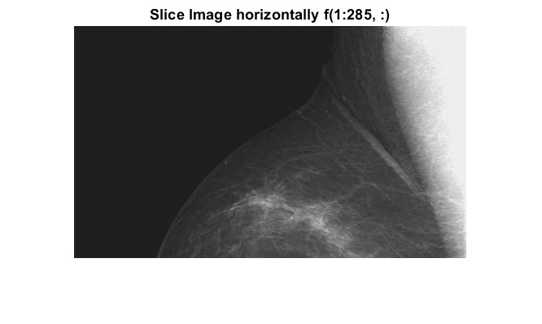  
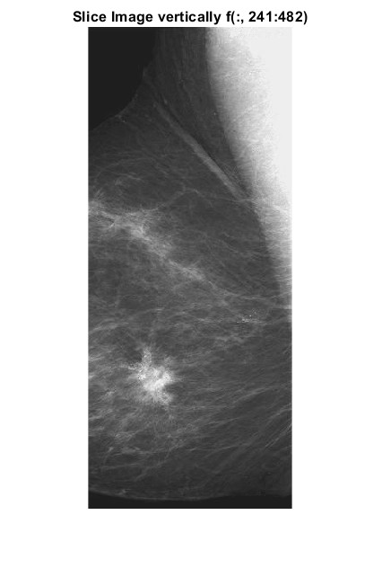

### Negative Image

```
g1 = imadjust(f, [0 1], [1 0])
figure                          % open a new figure window
imshowpair(f, g1, 'montage')
```

The function **imadjust()** was used for this operation
- Parameter 1: Takes in the target image `f`
- Parameter 2: `[low_in, low_out]` (values are between 0 and 1) 
	- `[0, 1]` takes the full range of values, and is same as default `[ ]`
- Parameter 3: `[high_in, high_out]` 
- Function thus maps the lowest intensity pixels (at 0) to highest intensity pixels (at 1), and vice versa
- Intensities are thus inversed to make a negative image

Note that this can also be accomplished with function **imcomplement**

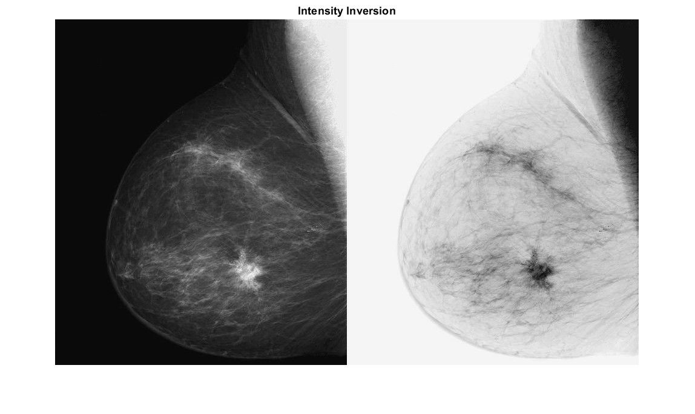

### Gamma Correction

```
g2 = imadjust(f, [0.5 0.75], [0 1]);
g3 = imadjust(f, [ ], [ ], 2);
figure
montage({g2,g3})
```

- g2:  grayscale range between 0.5 and 0.75 mapped to the full range
- g3:  gamma correct with $\gamma$ = 2.0 (see graph below) 
	- `[ ]` is the same as `[0 1]` by default.]
	- Produces a similar result to g2 by compressing low end and expanding high end
	- But retains more information since the intensity covers the full greyscale range
- **montage()** stitches the images in the list with `{}`


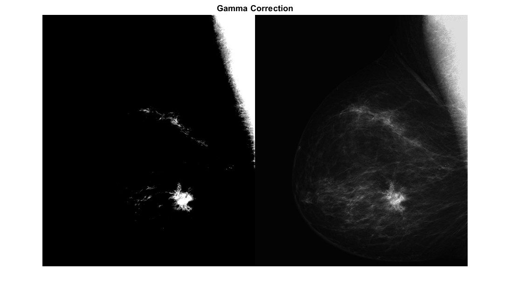

---
## 2 - Contrast-Stretching

Instead of imadjustm we can apply contrast stretching with the transformation function below:


The equation is 
$$s = T(r) = {1 \over 1 + (k/r)^E}$$ 
- $k$ is often set to average intensity level
- $E$ determines steepness of the function

```
clear all      
close all       
f = imread('assets/bonescan-front.tif');
r = double(f);  % uint8 to double conversion
k = mean2(r);   % find mean intensity of image
E = 0.9;
s = 1 ./ (1.0 + (k ./ (r + eps)) .^ E);
g = uint8(255*s);
imshowpair(f, g, "montage")
```

- `eps` is a 'Floating-point relative accuracy', the smallest possible value for a double precision floating point. It is used to prevent dividing by 0
- `double()` converts the image intensity from `uint8` to `double`, since the equation uses floating numbers. 
- `mean2()` computes the average value of the 2D matrix
- `s` stores the computation: the stretch function is applied per element of `r`
	- These intensity values are normalized to range `[0.0 1.0]` in type `double`
	- To scale it back to range `[0 255]`, we convert it back to `uint8()`

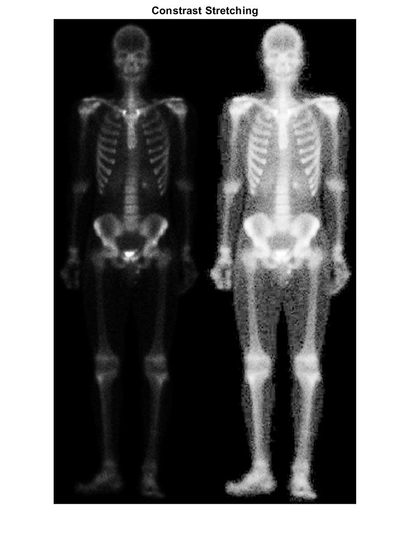

The original image does not have very good contrast, and details are hard to see. 
The contrast stretched image raises intensity of middle intensity pixels - allowing the bones to appear much whiter and easier to study, and it also exposes the muscles of the body which was not visible beforehand.

## 3 - Contrast Enhancement with Histograms

### Plotting an Image's Histogram

Function `imhist()` computes a histogram of an image and plots it
```
clear all       % clear all variable in workspace
close all       % close all figure windows
f=imread('assets/pollen.tif');
imshow(f)
figure          % open a new figure window
imhist(f);      % calculate and plot the histogram
```

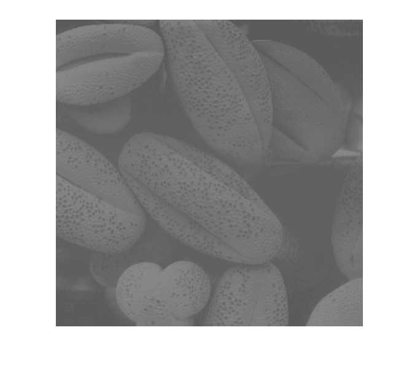

- Intensity of this image is squashed between 70 and 140 in the `[0 255]` range

Try stretching the intensity between range `[0.3 0.55]` of the full scale (255) using `imadjust()`

```
g=imadjust(f,[0.3 0.55]);
montage({f, g})     % display list of images side-by-side
figure
imhist(g);
title('Stretching with imadjust')
```

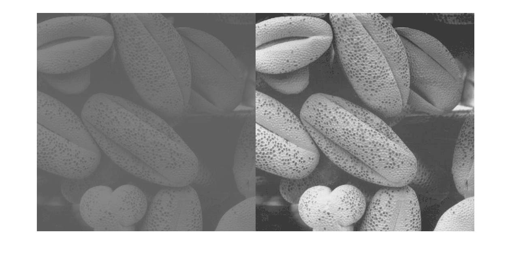
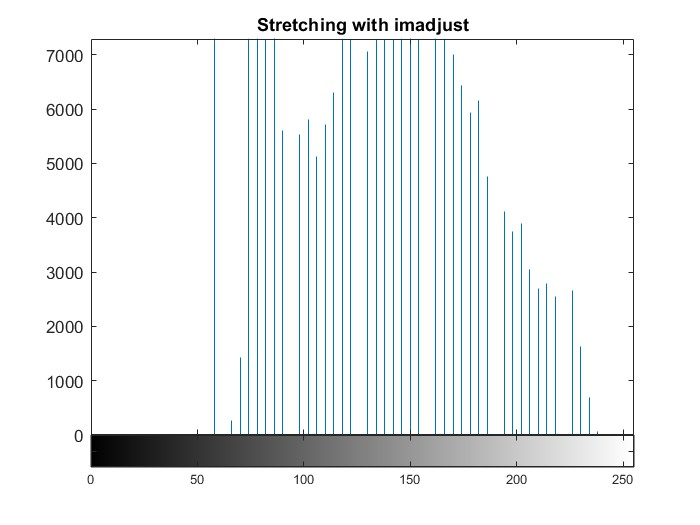

- Intensities are now more spread out, but still not a very good image

## Histogram, PDF, CDF

- Probability dist function (PDF) is a normalised histogram
- Cumulative dist function (CDF) integrates the cumulative sum of the PDF

```
g_pdf = imhist(g) ./ numel(g);  % compute PDF
g_cdf = cumsum(g_pdf);          % compute CDF
close all                       
imshow(g);                      % note that this is the imadjusted func
subplot(1,2,1)                  % plot 1 in a 1x2 subplot
plot(g_pdf)
subplot(1,2,2)                  % plot 2 in a 1x2 subplot
plot(g_cdf)
```

- `numel` returns total number of elements in the matrix
- `subplot(m,n,p)` specifies the subplot to use

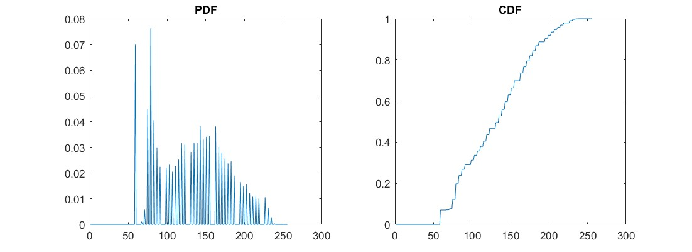

## Histogram Equalization

Histogram equalization is performed by using CDF as the intensity transformation function

Replot CDF to make it look better:
```
x = linspace(0, 1, 256);    % x has 256 values equally spaced between 0 and 1
figure
plot(x, g_cdf)
axis([0 1 0 1])             % graph x and y range is 0 to 1
set(gca, 'xtick', 0:0.2:1)  % x tick marks are in steps of 0.2
set(gca, 'ytick', 0:0.2:1)
xlabel('Input intensity values', 'fontsize', 9)
ylabel('Output intensity values', 'fontsize', 9)
title('Transformation function', 'fontsize', 12)
```

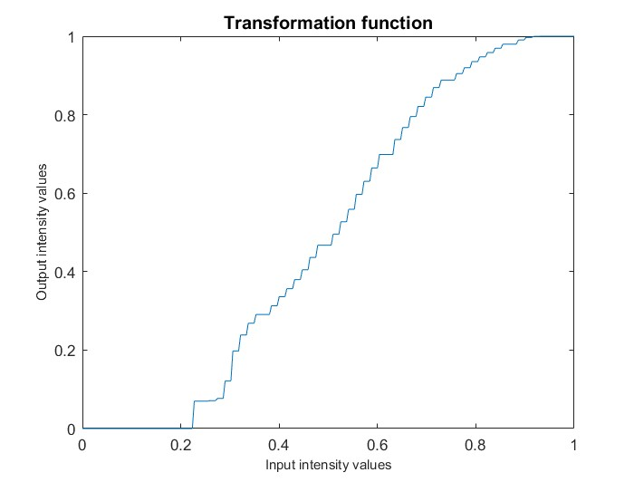

Apply CDF to the image:
```
h = histeq(g,256);              % histogram equalize g
close all
montage({f, g, h})
figure;
subplot(1,3,1); imhist(f);
subplot(1,3,2); imhist(g);
subplot(1,3,3); imhist(h);
```

- `histeq()` computes CDF and uses it as intensity transformation to flatten the histogram.

See below for all three versions and their plots
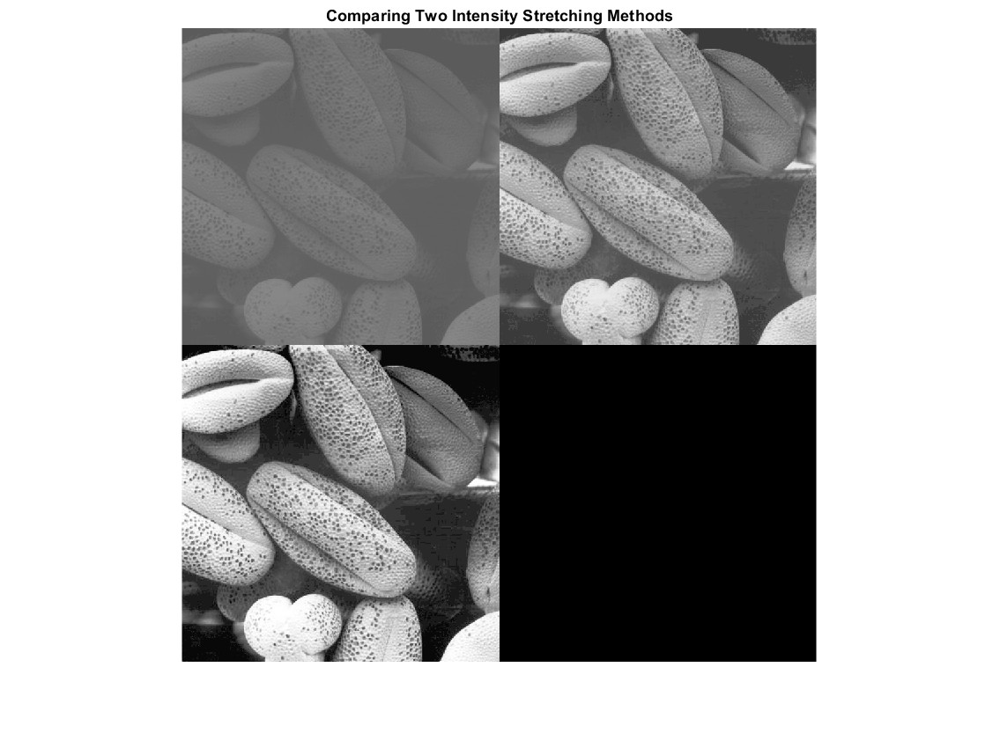

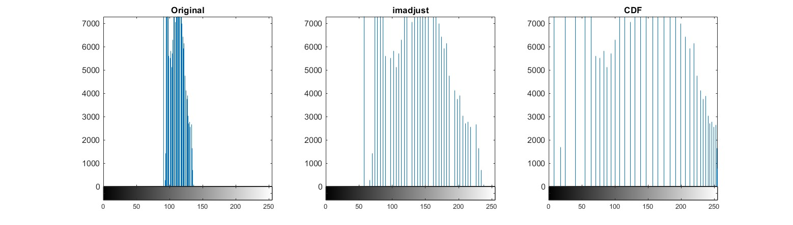

The final version is very clear and nicely contrasted.

## 4 - Lowpass Filter Noise Reduction

Exploring the effects of:
- Special Filter Kernel like Averaging (box), Gaussian, Laplacian, Sobel
- Smoothing filters: Moving average (box) filter and Gaussian filter

Using this noisy PCB x-ray image

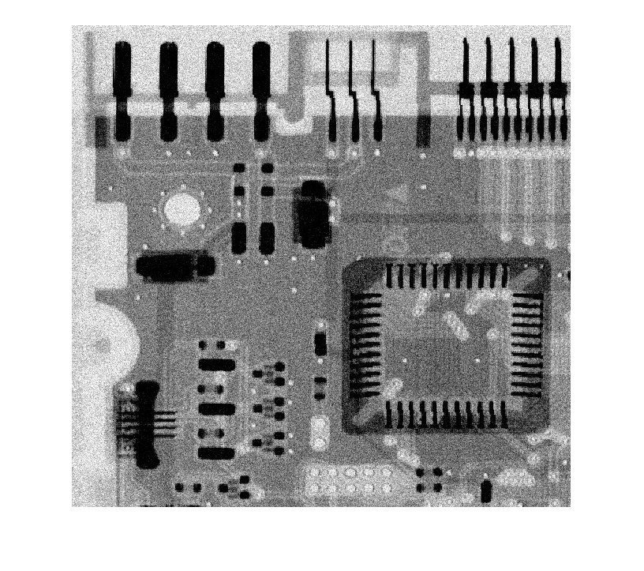

First define filter kernel, provided by `fspecial`


Producing box and gaussian filters:

```
w_box = fspecial('average', [9 9])
w_gauss = fspecial('Gaussian', [7 7], 1.0)
```
- `w_box`: 9x9 averaging filter kernel
- `w_gauss`: 7x7 Gaussian kernel with $\sigma = 0.5$ 
- note the coefficients are scaled such that they sum to 1

The matrices look like this:
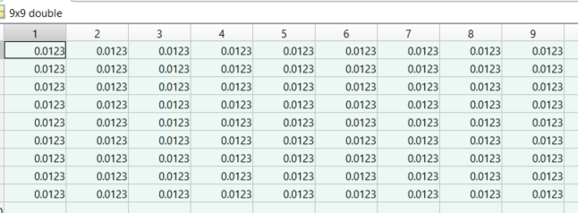
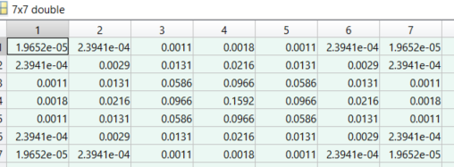

Apply the filter:
```
g_box = imfilter(f, w_box, 0);
g_gauss = imfilter(f, w_gauss, 0);
figure
montage({f, g_box, g_gauss})
```

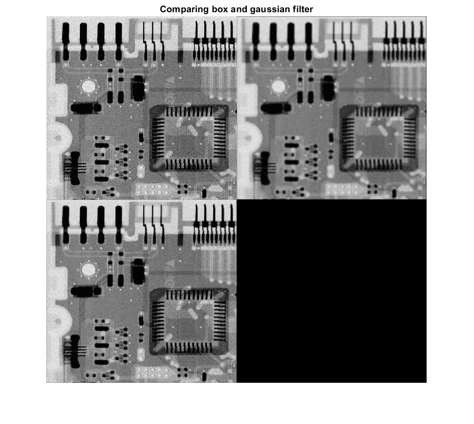

Gaussian gives a clearer image while box seems to be blurry

TBD | Test yourself: Explore various kernel size and sigma value for these two filters. Comment on the trade-off between the choice of these parameters and the effect on the image.

## 5 - Median Filtering

With both filters, noise reduction reduces the sharpness of the image.
Median filter is useful as it preserves sharpness.

```
g_median = medfilt2(f, [7 7], 'zero');
figure; montage({f, g_median})
```
- `medfilt2(l,[m n],padopt)` 
	- `[m n]` defines kernel dimension
	- `padopt` specifies padding option at the boundaries (default 0 padding)

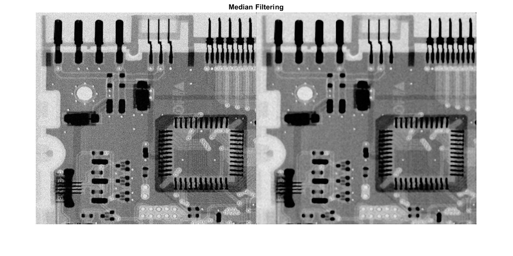

The median filtered image has lowpass applied, making the high intensity values seem more obvious.

## 6 - Sharpening with Other Filters

- Laplacian: 3x3 filter shaped by value alpha in range `[0 1]`, default is 0.5
- Sobel: 3x3 mask, sv, that approximates a vertical gradient. 
	- A horizontal gradient is created by transposing sv' = sh
- Unsharp: 3x3 filter shaped by alpha, which is >0 and =< 1, default being 0.2.

```
clear all
close all
f = imread('assets/moon.tif');
imshow(f)
title('Original Moon Image')

w_lapla = fspecial('laplacian', 0.5); % 0.5 is the default alpha
w_sobel = fspecial('sobel');
w_unsharp = fspecial('unsharp', 0.2); % 0.2 is the default alpha

g_lapla = imfilter(f, w_lapla, 0);
g_sobel = imfilter(f, w_sobel, 0);
g_unsharp = imfilter(f, w_unsharp, 0);

figure;
montage({f,g_lapla,g_sobel,g_unsharp})
title('Original vs Laplacian vs Sobel vs Unsharp')
```

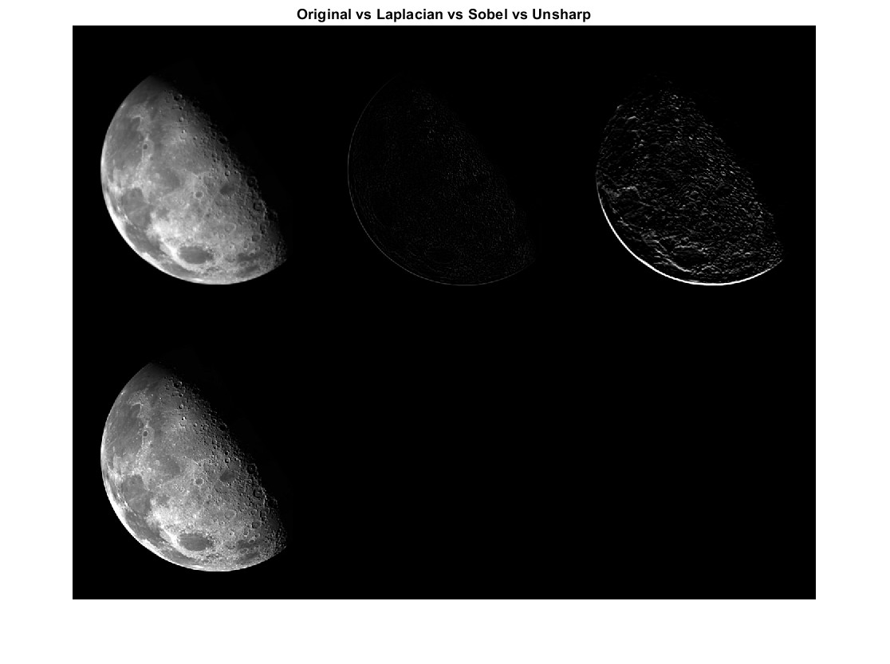

## 7 - Test Yourself Challenges 